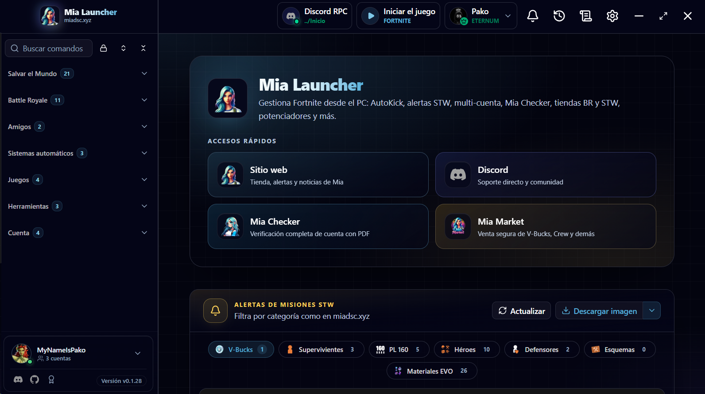

# Mia Launcher

**Dein Desktop-Begleiter für Fortnite**  
Save-the-World-Alerts, mehrere Epic-Konten und nützliche Tools — alles an einem Ort, verbunden mit [Mia](https://miadsc.xyz).

[**Für Windows herunterladen**](https://github.com/MyNameIsPako/Mia-Launcher/releases/latest) · [**Website**](https://miadsc.xyz) · [**Discord**](https://discord.gg/miabot)

**Sprache:** [Español](../README.md) · [English](README.en.md) · Deutsch · [Français](README.fr.md) · [Português (BR)](README.pt-BR.md) · [Türkçe](README.tr.md)

---

## Was ist Mia Launcher?

Mia Launcher ist Mias offizielle Windows-App. Du bleibst bei **Rette die Welt** und **Battle Royale** auf dem Laufenden — ohne zwischen Websites und Discord zu springen: Alerts, Inventar, Epic-Konten und mehr, in einer klaren Oberfläche.

Sie arbeitet mit dem [Mia-Discord-Bot](https://miadsc.xyz) und der Website zusammen. Die Nutzung ist kostenlos; **Premium** schaltet Extras frei, wenn du das Projekt unterstützen möchtest.

---

## Download

| | |
| --- | --- |
| **System** | Windows 10 oder 11 (64-Bit) |
| **Datei** | `.exe`-Installer in der [aktuellen Version](https://github.com/MyNameIsPako/Mia-Launcher/releases/latest) |
| **Auch** | Über [miadsc.xyz](https://miadsc.xyz) |

1. Öffne [Releases → Latest](https://github.com/MyNameIsPako/Mia-Launcher/releases/latest).
2. Lade unter **Assets** den Installer herunter (`Mia-Launcher_…_x64-setup.exe`).
3. Starte ihn und folge dem Assistenten.

**Schon installiert?** Du musst nichts erneut herunterladen — die App meldet neue Versionen und aktualisiert sich selbst.

### Was du brauchst

- Windows 10 oder 11 (64-Bit)
- Internet
- Ein **Discord**-Konto (zum Anmelden)
- Ein **Epic-Games**-Konto (für die meisten Funktionen)

---

## Was du machen kannst

### Rette die Welt

- Tägliche **Missions-Alerts** (V-Bucks, Supercharger, Power Hour…) mit Filtern und Bild-Download
- **STW-Profil**: Homebase, Helden & Schemata (Waffenkammer), Inventar und Ressourcen
- **Automatisierungen**: AutoKick, Expeditionen und mehr — pro Konto
- Taxis, Tagesquests, Lamas und Kampagnen-Tools

### Battle Royale

- Täglicher Shop, Spind, V-Bucks und Serverstatus

### Deine Konten

- Mehrere Epic-Konten in einem Launcher
- Sofort zwischen Konten wechseln
- Freunde, Creator-Code und Code-Einlösung

### Und mehr

- Spielersuche
- Fortnite-Bibliothek & Installation
- Die App in deiner Sprache (Spanisch, Englisch, Deutsch, Französisch, Italienisch, Portugiesisch, Türkisch, Japanisch, Chinesisch…)

---

## Erste Schritte

1. Öffne Mia Launcher und melde dich mit **Discord** an.
2. Füge ein oder mehrere **Epic**-Konten hinzu.
3. Auf der Startseite siehst du die **STW-Alerts**; die Seitenleiste führt zu allem anderen.

Einträge mit Schloss brauchen zuerst ein aktives Epic-Konto.

Mehr Funktionen und Mia unterstützen? Schau dir [Premium](https://miadsc.xyz/es/premium) an.

---

## Hilfe

- Community: [discord.gg/miabot](https://discord.gg/miabot)
- Website: [miadsc.xyz](https://miadsc.xyz)

Wenn etwas nicht klappt, schreib uns auf Discord: **Launcher-Version**, was du gemacht hast und möglichst einen **Screenshot**. So finden wir die Lösung schneller.

---

## Rechtlicher Hinweis

Mia Launcher ist **nicht** mit Epic Games verbunden oder von Epic gesponsert. Fortnite® ist eine Marke von Epic Games, Inc.

Drittanbieter-Tools können gegen die Nutzungsbedingungen von Epic verstoßen. Die Nutzung erfolgt auf eigene Verantwortung.

---

## Lizenz

Mia Launcher ist proprietäre Software. Hier erscheinen nur Installer und Versionshinweise — **alle Rechte vorbehalten**.
