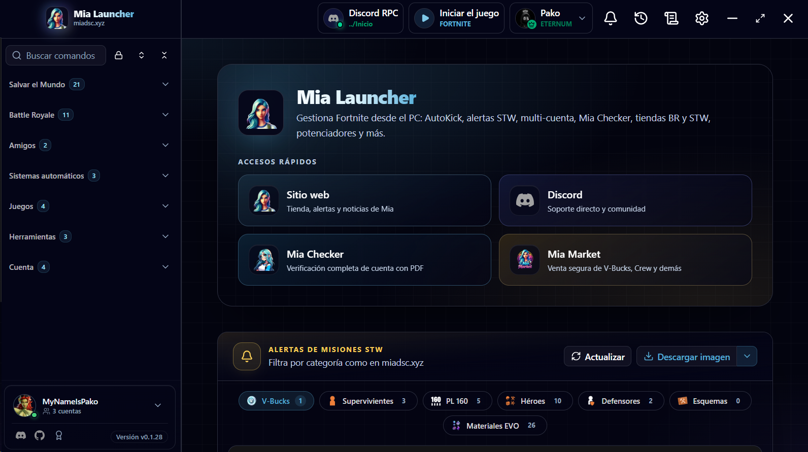

# Mia Launcher

**Centre de contrôle bureau pour Fortnite**  
Sauver le Monde, Battle Royale et comptes Epic — intégré à l'écosystème [Mia](https://miadsc.xyz).

[**Télécharger**](https://github.com/MyNameIsPako/Mia-Launcher/releases/latest) · [**Site officiel**](https://miadsc.xyz) · [**Discord**](https://discord.gg/miabot)

**Langue :** [Español](../README.md) · [English](README.en.md) · [Deutsch](README.de.md) · Français · [Português (BR)](README.pt-BR.md) · [Türkçe](README.tr.md)

---

## Sommaire

- [À propos](#à-propos)
- [Téléchargement](#téléchargement)
- [Fonctionnalités](#fonctionnalités)
- [Premiers pas](#premiers-pas)
- [Support](#support)
- [Mention légale](#mention-légale)
- [Licence](#licence)

---

## À propos

Mia Launcher est l'application bureau officielle de Mia pour les joueurs de Fortnite. Alertes STW, multi-comptes, outils de campagne et automatisation liée au bot — le tout dans une interface Windows unifiée.

> Ce dépôt publie **installateurs et notes de version**. Le code de l'application n'est pas distribué ici.

---

## Téléchargement

- **Plateforme :** Windows 10 ou 11 (64 bits)
- **Installateur :** [`Mia-Launcher_*_x64-setup.exe`](https://github.com/MyNameIsPako/Mia-Launcher/releases/latest) (section *Assets* de la dernière release)
- **Alternative :** [miadsc.xyz](https://miadsc.xyz)

<strong>Installation pas à pas</strong>

1. Ouvre [Releases → Latest](https://github.com/MyNameIsPako/Mia-Launcher/releases/latest).
2. Télécharge le `.exe` dans la section **Assets**.
3. Lance l'installateur et suis l'assistant.

<strong>Mises à jour</strong>

Si Mia Launcher est déjà installé, **inutile de réinstaller**. L'app détecte les nouvelles versions et se met à jour automatiquement à chaque release.

### Prérequis

- Windows 10 ou 11 (64 bits)
- Connexion internet stable
- Compte **Discord** (obligatoire pour se connecter)
- Compte **Epic Games** (nécessaire pour la plupart des fonctions)

---

## Fonctionnalités

### Sauver le Monde

Alertes de missions, boutique STW, quêtes quotidiennes, journal de quêtes, inventaire, llamas, homebase, MiaTaxi's et AutoKick.

### Battle Royale

Boutique BR, casier, V-Bucks et état des serveurs Epic.

### Comptes Epic

Multi-comptes, amis, code créateur (SAC), échange de codes, EULA et outils d'auth (token, exchange code, device auth).

### Utilitaires

Recherche de joueurs, console MCP, bibliothèque Epic et installation de jeux.

### Langues dans l'app

Espagnol, anglais, allemand, français, portugais (BR) et turc — configurable dans **Paramètres**.

---

## Premiers pas

1. Connecte-toi avec **Discord**.
2. Ajoute tes comptes **Epic**.
3. Explore **Accueil** (alertes STW) et le menu latéral.

Les entrées du menu avec cadenas nécessitent un compte Epic actif.

> Code créateur recommandé : **`NotMia`** — aussi dans **Compte → SAC**.

---

## Support

- **Discord :** [discord.gg/miabot](https://discord.gg/miabot)
- **Site :** [miadsc.xyz](https://miadsc.xyz)

**Signaler un bug :** indique la version du launcher, les étapes pour reproduire et des captures. Avec les logs de débogage (*Paramètres*), joins aussi la sortie **F12 → Console**.

---

## Mention légale

Mia Launcher **n'est pas affilié, approuvé ou sponsorisé par Epic Games**. Fortnite est une marque déposée d'Epic Games, Inc.

L'automatisation et les outils tiers peuvent enfreindre les conditions d'utilisation d'Epic. **Utilise l'application à tes propres risques.**

---

## Licence

Mia Launcher est un logiciel **propriétaire**. Le code source n'est pas distribué et n'est pas disponible sous licence open source.

Ce dépôt publie uniquement releases, notes de version et ressources de distribution. **Tous droits réservés.**
